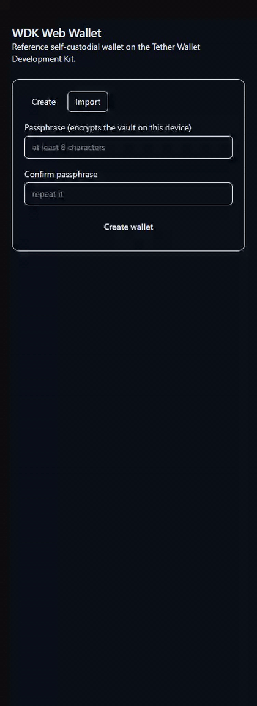

# WDK Wallet: Web Starter

A self-custodial, multi-chain web wallet built on Tether's
[Wallet Development Kit](https://github.com/tetherto/wdk-core). It is the
production-grade **web** counterpart to the official
[`wdk-starter-react-native`](https://github.com/tetherto/wdk-starter-react-native),
which Tether ships **only for React Native**.

**Bitcoin and USD₮ both work, on the web, client-side.** Create or import a
seed, unlock with a passkey or passphrase, then send and receive real BTC and
USD₮ (plus XAUT). Key material never leaves the browser, the WDK signer
runs in a dedicated Web Worker, and there is nothing custodial in between.

**Docs:** [`Project summary`](docs/PROJECT-SUMMARY.md) ·
[`Review guide`](docs/REVIEW.md) ·
[`Verification checklist`](docs/VERIFICATION-CHECKLIST.md)



> Recorded end-to-end against the real built app. The BTC row is served by a
> local, offline Electrum-WS fixture so the preview stays reproducible with no
> endpoint and no secret. The addresses and keys are real client-side
> derivation. A full walkthrough video lives at
> [`docs/walkthrough.mp4`](docs/walkthrough.mp4). Regenerate locally:
> `corepack pnpm demo` (one-time `corepack pnpm exec playwright install
> chromium`, plus `ffmpeg` on PATH).

**Live demo:** **https://wdk-wallet-web-production.up.railway.app**, the real
built app, served under the same strict per-request-nonce CSP and security
headers as production. This deploy runs the five default chains
(Ethereum, Polygon, Arbitrum, Plasma + Solana) plus **Bitcoin** through a
public Blockstream Electrum-WS endpoint. Your seed is generated and encrypted
in your own browser; the deploy holds no keys and nothing custodial.

**Walkthrough video:** a silent ~90 s screencast of the whole flow lives at
[`docs/walkthrough.mp4`](docs/walkthrough.mp4) (create → back up → portfolio →
receive → send form). Product notes and verification details live in
[`docs/PROJECT-SUMMARY.md`](docs/PROJECT-SUMMARY.md).

No install is required to try the wallet. Open the live demo above and use it in
the browser. The local setup below is for development and independent review.

## Run locally in two minutes

```bash
pnpm install
pnpm --filter next dev          # → http://localhost:3000
```

That starts the wallet locally on its five default chains with zero config
(ETH + USD₮ / XAUT on Ethereum, USD₮ on Polygon / Arbitrum / Plasma / Solana).
To enable Bitcoin locally, point it at an Electrum-over-WebSocket endpoint:

```bash
cp apps/next/.env.example apps/next/.env.local
# set NEXT_PUBLIC_BTC_ELECTRUM_WS_URL=wss://<your-electrum-host>:50004
pnpm --filter next dev
```

With no endpoint set, the local app still runs on its five default chains
(Ethereum, Polygon, Arbitrum, Plasma + Solana) and BTC surfaces a typed,
honest "unsupported chain" error instead of failing silently.

## What Ships Today

| Capability | Status |
|---|---|
| Send / receive **USD₮** on web | Yes. USDT on Ethereum, Polygon, Arbitrum, Plasma, and Solana, plus XAUT on Ethereum |
| Send / receive **BTC** on web | Yes. Pure-JS WDK BTC manager with an injected Electrum-WS client in the worker |
| Self-custodial, keys client-side | Yes. WebCrypto vault and Web Worker signer (ADR-004) |
| Unlock | Yes. WebAuthn passkey (PRF) with a PBKDF2 passphrase fallback (ADR-005) |
| Multi-wallet / multi-account | Yes. Independent BIP-39 seeds with HD accounts and zero-migration back-compat |
| QR | Yes. Scan a BIP-21 or EIP-681 request into Send and render Receive as QR |
| Reusable across hosts | Yes. The same headless core powers a second app in Svelte |
Across supported chains, the wallet ships **four EVM networks**
(Ethereum, Polygon, Arbitrum, Plasma, all via the WDK EVM manager), **Solana**
(USD₮ as an SPL token via `@tetherto/wdk-wallet-solana` through the same
adapter seam), and **Bitcoin**. All five non-BTC chains are default-on with
keyless public RPC. In CI, the Ethereum and BTC fixture flows are exercised
end-to-end; the Solana, Polygon, Arbitrum, and Plasma managers are wired,
typed, built, and covered at the config and portfolio layers, but their
live-RPC send / receive paths are not part of CI. **Lightning / Spark are not
shipped**: they remain documented extension points.

The one honest operational dependency: a browser cannot open a raw Electrum TCP
socket, so BTC needs a **public Electrum-WS endpoint** to point at (env-driven,
failover via `@tetherto/wdk-failover-provider`). That is a real deployment
input, not a missing feature. See `docs/RN-TO-WEB-MAP.md` →
"Bitcoin on web (shipped)".

## Why It Is Structured This Way

The repo mirrors the architecture of Tether's own RN starter, which cleanly separates
**platform-agnostic wallet logic** from **platform-specific UI / storage**:

- **`packages/wallet-core`**: a headless, fully-typed, tested WDK wallet engine
  (orchestration, encrypted key vault, chains / failover config, balances, send,
  receive, activity). Zero UI. Zero framework lock-in.
- **`apps/next`**, the reference Next.js app: full screen parity with the RN
  starter (onboarding → wallet-setup → unlock → portfolio → token detail → send
  → receive → activity → settings).
- **`apps/svelte`** (package `svelte-proof`): a Svelte 5 + Vite app that runs
  the core's state machine against the **byte-unchanged** engine, proving
  `wallet-core` is genuinely framework-agnostic, not Next-coupled. Ships with a
  headless portability test (`test/portability.test.ts`). **English-only by
  design:** the Svelte app is the portability proof that the shared core ports
  to a second framework; the localized (en/ru/uk) reference wallet is
  `apps/next`. Svelte localization would duplicate UI work without adding
  anything to the portability claim.

The same headless core can be reused for a browser extension or an eCommerce
checkout flow.

## Layout

```
packages/wallet-core/   headless WDK engine (the spine)
apps/next/              reference web wallet (the deliverable)
apps/svelte/            portability proof (Svelte 5 + Vite; pkg svelte-proof)
docs/
  ARCHITECTURE.md       module boundaries, data flow, ADRs
  PROJECT-SUMMARY.md    concise product and verification summary
  REVIEW.md             fast reviewer orientation
  VERIFICATION-CHECKLIST.md  requirement-to-proof map
  SECURITY.md           threat model & honest limits
  SECURITY-REVIEW.md    structured review: CSP rationale, secrets lifecycle, audit advisory
  RN-TO-WEB-MAP.md      every RN platform API → its web replacement
.github/workflows/ci.yml  lint · typecheck · test · build
```

## Verify And Develop

```bash
pnpm install
corepack pnpm verify                      # lint, typecheck, test, build (all 3 packages)
corepack pnpm smoke                       # E2E: create → seed quiz → portfolio → receive a11y → Recovery Check
corepack pnpm demo                        # records docs/demo.gif (one-time: playwright install chromium)
corepack pnpm audit --audit-level moderate  # one accepted low advisory (docs/SECURITY-REVIEW.md §7)
corepack pnpm --filter next dev
```

`corepack pnpm smoke` builds the production app, serves it on a free port, and
drives a real browser through the reviewer walkthrough under the live strict
CSP. A passing run is also proof of zero CSP violations.

CI (`.github/workflows/ci.yml`) runs the same bar on every push and PR:
`lint · typecheck · test · build` across **both** apps on a Node 20 + 22
matrix, plus a committed-secret scan. The same quartet runs locally via
`corepack pnpm verify`; the caveat at the top of `ci.yml` explains why a local green
and a CI green mean the same thing. WDK is alpha; package versions are pinned
(see `docs/ARCHITECTURE.md` → Alpha-churn containment). Never commit `.env*`.

## Status & honest limits

- **Shipped:** onboarding · unlock (passkey / passphrase) · multi-wallet ·
  multi-account · portfolio · receive (+ QR) · send (+ QR scan) · tx-confirm ·
  activity, for **USD₮ on Ethereum / Polygon / Arbitrum / Plasma / Solana +
  XAU₮ on Ethereum + BTC**, in `apps/next`; `apps/svelte` runs that same
  byte-unchanged core at full parity (the one delta is passphrase-only unlock)
  as the portability proof. Built in phases. Honest CI bound: only the Ethereum
  and BTC-fixture flows are exercised end-to-end; the other managers (Solana,
  Polygon, Arbitrum, Plasma) are wired, typed, built and config + portfolio
  unit-covered, but their live-RPC paths are not in CI.
- **Not shipped (honest):** Lightning / Spark, same adapter shape, left as
  documented extension points, not claimed as done. Token-detail and settings
  screens are folded into the single page rather than separate routes.
- **BTC operational dependency:** needs a public Electrum-WS endpoint
  (env-driven, failover-capable). Unset → the five keyless default chains (four
  EVM nets + Solana) and a typed error for BTC. Detail in
  `docs/RN-TO-WEB-MAP.md`.
- **WDK is alpha:** `@tetherto/*` versions are pinned exact and quarantined
  behind `packages/wallet-core/src/wdk/` (ESLint-enforced), so an upstream break
  is one-file localized.
- **Deployment:** the Railway live demo above auto-deploys from `main`.
- **Not for production use with real funds yet.** The web has no exact
  equivalent of the RN starter's BareKit worklet + native Keychain +
  biometrics; we do not pretend it does. The real threat model and the residual
  XSS risk are stated plainly in `docs/SECURITY.md`. Honest limits over false
  parity.
